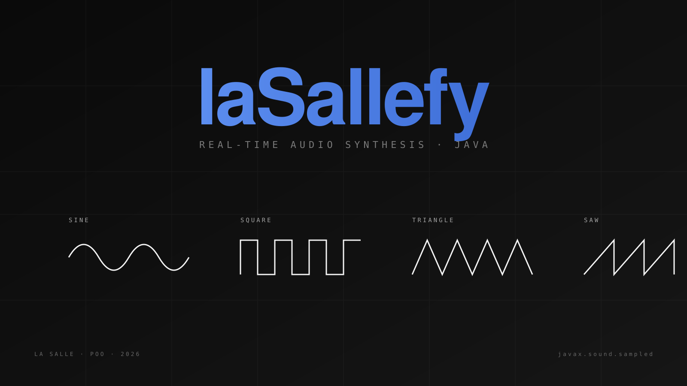

# laSallefy



Java 17 console music player that creates sound in real time with four custom waveform synthesizers. It uses no MP3 or WAV files: every song is a sequence of frequency, duration and timbre values generated through `javax.sound.sampled`.

The codebase follows a strict View, Controller, Manager, DAO and Model architecture with GRASP principles, JSON persistence through Gson, reference based playlists and playback on a separate thread.

### Català

Reproductor musical de consola en Java 17 que sintetitza cada so en temps real amb ones sinusoidals, quadrades, triangulars i de serra. La separació per capes permet treballar en paral·lel i canviar persistència o interfície sense reescriure el motor.

### Español

Hemos construido un reproductor musical de consola que genera el sonido directamente mediante un sintetizador propio. La idea era hacer algo parecido a Spotify pero a escala muy reducida y sin usar archivos de audio reales. En lugar de reproducir un MP3, cada canción está formada por una secuencia de sonidos (frecuencia, duración y timbre), y nuestro sintetizador convierte esos sonidos en ondas que suenan por los altavoces gracias a la API `javax.sound.sampled`.

Toda la información (canciones, playlists) se guarda en ficheros JSON. Para serializar y deserializar usamos Gson, que es la librería que vimos en la sesión 14 del temario.


## Cómo compilar y ejecutar

Necesitas Java 17 o superior instalado y el `.jar` de Gson dentro de la carpeta `lib/` (nosotros usamos `gson-2.13.2.jar`).

Desde la raíz del proyecto:

```bash
javac -cp "lib/gson-2.13.2.jar" -d out $(find src -name "*.java")
java  -cp "out:lib/gson-2.13.2.jar" Main
```

En Windows el separador del classpath es `;` en vez de `:`:

```bash
java -cp "out;lib/gson-2.13.2.jar" Main
```

Si trabajas desde IntelliJ basta con abrir la carpeta como proyecto, marcar `src` como Sources Root, añadir la librería de `lib/` al módulo y darle a Run sobre `Main.java`. El `.iml` ya viene con esa configuración.


## Estructura de la aplicación

Hemos seguido la arquitectura por capas que se explica en el repositorio del temario, porque es la que mejor encaja con un proyecto de este tamaño y facilita mucho separar responsabilidades. El flujo siempre va de arriba hacia abajo:

```
View  →  Controller  →  Manager  →  DAO  →  Ficheros JSON
```

Cada capa hace una cosa concreta y no se mete en lo que no le toca.

`View` es solo la interfaz con el usuario. Tenemos una interfaz `View` y una implementación `ConsoleView` que se encarga de leer y escribir por consola. Si algún día quisiéramos hacer una versión gráfica, solo tendríamos que escribir otra clase que implementara la misma interfaz.

`Controller` recibe lo que el usuario quiere hacer y coordina al resto. No tiene lógica de negocio, simplemente delega: pide los datos a la `View`, llama al `Manager` correspondiente y muestra el resultado. Hemos puesto un único `Controller` que gestiona los submenús.

`LibraryManager` y `PlaybackManager` son las clases que contienen la lógica real. El `LibraryManager` gestiona la biblioteca de canciones y playlists (añadir, eliminar, buscar por id, comprobar duplicados, etc.). El `PlaybackManager` se encarga de la reproducción y de coordinar los distintos sintetizadores. En esta capa también vive `AlbumGenerator`, que genera álbumes aleatorios filtrando por mood.

`SongsDAO` y `PlaylistsDAO` son interfaces que definen el contrato de persistencia, y `JsonSongsDAO` y `JsonPlaylistsDAO` son las implementaciones concretas que leen y escriben los JSON con Gson. Si mañana decidimos guardar en base de datos solo tenemos que escribir un nuevo DAO sin tocar nada más.

El modelo de datos sigue el ejemplo de la sesión 16. `Song` tiene id (String), título, artista, duración aproximada, mood, style, un campo `playable` explícito y una lista de objetos `Sound`. Cada `Sound` es una clase concreta con tres atributos: frecuencia (Hz), duración en milisegundos y timbre (SINE, SQUARE, TRIANGLE o SAWTOOTH). De esta forma una canción no es más que una secuencia de pares (frecuencia, duración) con su forma de onda asociada.

`Playlist` también tiene id String, nombre, descripción, mood, una lista de ids de canciones (no objetos canción, solo las referencias) y un campo `random` que indica si fue generada automáticamente por el `AlbumGenerator`.

Los sintetizadores siguen la jerarquía vista en la sesión 13: `SoundSynth` es una clase abstracta con el método `makeSound(frequency, durationMs)` declarado como abstracto. Cuatro subclases (`SoundSynthSine`, `SoundSynthSquare`, `SoundSynthTriangle` y `SoundSynthSawtooth`) implementan cada una su propia versión usando la forma de onda correspondiente. El `PlaybackManager` mantiene un mapa que asocia cada timbre con su sintetizador y elige el adecuado para cada sonido en función del campo `timbre` del `Sound`.


## Reproducción en un hilo aparte

Hemos añadido un pequeño detalle de concurrencia. La reproducción se lanza en un `Thread` separado, así que mientras suena una canción el menú sigue activo y podemos pausarla y reanudarla escribiendo `P`, o pulsar `ENTER` para parar y volver al menú. En el caso de una playlist, todas las canciones suenan en ese mismo hilo una detrás de otra de forma automática, sin que haga falta pulsar nada entre canción y canción. Lo controlamos con dos flags `volatile boolean` (`paused` y `stopped`) que la rutina del thread va comprobando entre sonido y sonido.

No es una pausa de altísima precisión (no corta un sonido a medias), pero es perfectamente válida para una app de consola y se queda dentro del nivel que se enseña en la sesión 17.


## Ejemplos de uso

Nada más arrancar aparece el menú principal:

```
■■■ laSallefy ■■■
1. Gestionar canciones
2. Gestionar playlists
3. Reproducir
4. Generar álbum random por mood
Q. Salir
Elige una opción:
```

Si elegimos la opción 1 entramos en la gestión de canciones:

```
--- Gestión de canciones ---
1. Listar canciones
2. Añadir canción
3. Eliminar canción
B. Volver
```

Para añadir una canción, la app pregunta el título, el artista, la duración aproximada, el mood y el style. Después pregunta si la canción será reproducible. Si decimos que sí, elegimos un timbre (SINE, SQUARE, TRIANGLE o SAWTOOTH) y una de las cuatro plantillas de melodía predefinidas en código (Happy Birthday, una escala ascendente, un arpegio o un tono de aviso). La plantilla rellena automáticamente la lista de sonidos, así que no hay que introducir nota a nota. Si decimos que no, la canción se guarda solo con metadatos y queda como NOT PLAYABLE.

Reproducir una canción es tan sencillo como entrar en la opción 3 del menú principal, escoger 1 (Reproducir canción), seleccionar el id de una canción reproducible (por ejemplo `s001`) y dejar que suene. Durante la reproducción aparece este menú:

```
--- Reproduciendo: Happy Birthday ---
P = pausar / reanudar  |  ENTER = volver al menú:
```

Si tecleamos `P` la canción se pausa entre sonido y sonido, y si volvemos a teclear `P` continúa donde estaba. Si pulsamos `ENTER` paramos la reproducción y volvemos al menú. Si no tocamos nada, la canción (o la playlist entera) suena hasta el final ella sola, y al pulsar `ENTER` volvemos al menú.

La opción 4 del menú principal genera un álbum aleatorio. Pide un mood (por ejemplo HAPPY) y una duración objetivo en minutos, busca todas las canciones reproducibles con ese mood y construye una playlist nueva que se acerca lo máximo posible al tiempo pedido. La nueva playlist queda guardada en `playlists.json` con el campo `random` a true.


## Datos iniciales

El proyecto trae dos JSON con datos de ejemplo, tomados directamente del material de la sesión 16:

`songs.json` contiene 10 canciones de distintos moods (HAPPY, SAD, RELAX, ENERGETIC), de las cuales 6 son reproducibles. Las no reproducibles llevan el campo `playable` a false y un array `sounds` vacío.

`playlists.json` trae cuatro playlists: tres normales (Morning Vibes, Chill Out, Game Soundtrack) y una marcada como `random` (Random RELAX – 10min) para mostrar cómo se ve un álbum generado automáticamente.


## Algunas decisiones que vale la pena explicar

Hemos mantenido los moods y styles como Strings en lugar de enums, siguiendo el ejemplo de la sesión 16. Esto da algo más de flexibilidad para añadir nuevos valores sin tocar código, aunque a cambio perdemos la seguridad de tipos en compilación. Lo validamos en el Controller restringiendo las opciones del menú a una lista fija de valores conocidos.

Los timbres también son Strings (SINE, SQUARE, TRIANGLE, SAWTOOTH) y el `PlaybackManager` los usa como claves de un HashMap para escoger el sintetizador correspondiente.


## Estructura de carpetas

```
Sallefy/
  src/
    Main.java
    model/        Sound, Song, Playlist
    dao/          SongsDAO, PlaylistsDAO + implementaciones Json + DataAccessException
    manager/      LibraryManager, PlaybackManager, AlbumGenerator
    controller/   Controller
    view/         View, ConsoleView
    synth/        SoundSynth + las 4 subclases (Sine, Square, Triangle, Sawtooth)
  lib/            gson-2.13.2.jar
  out/            clases compiladas
  songs.json      biblioteca de canciones
  playlists.json  playlists existentes
  README.md       este archivo
  Sallefy.iml     configuración del módulo IntelliJ
```

Hemos organizado el código en seis paquetes, uno por cada capa de la arquitectura más uno extra para los sintetizadores. De esta forma queda muy claro qué clase pertenece a qué responsabilidad y se ve a simple vista la separación entre Model, DAO, Manager, Controller y View.
